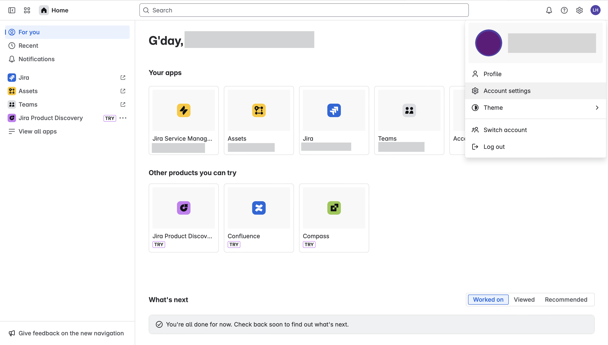

## Overview

Jira is a powerful project management and issue tracking platform developed by Atlassian, widely used for agile software development, bug tracking, and workflow management.

The ballerinax/jira package provides APIs to connect and interact with Jira’s REST API endpoints, enabling seamless integration for operations such as managing issues, projects, users, and workflows. The latest version corresponds to the REST API version 3 (Cloud), which builds upon v2 with additional support such as Atlassian Document Format (ADF) in fields like comments and descriptions.

## Setup guide

To use the Jira connector, you must have access to the Atlassian API through your Atlassian account. To access premium features, a Premium subscription is required. If you do not have an account, you can sign up for one [here](https://id.atlassian.com/login?continue=https%3A%2F%2Fwww.atlassian.com%2Fgateway%2Fapi%2Fstart%2Fauthredirect).

### Step 1: Create an Atlassian account

1. Sign up for an account or log in to your Atlassian account


2. You will be redirected after a successful login.


### Step 2: Create API token

1. Click on **account settings**


2. Click on **security** tab


3. Click on **Create and manage API tokens**


4. Create API token


5. Store the access token securely for use in your application.

## Quickstart

To use the `Jira` connector in your Ballerina application, update the `.bal` file as follows:

### Step 1: Import the module

Import the `jira` module.

```ballerina
import ballerinax/jira;
```
### Step 2: Instantiate a new connector

1. Create a `Config.toml` file and, configure the obtained credentials in the above steps as follows:

```bash
token = "<Access Token>"
```
2. Create a jira:ConnectionConfig with the obtained access token and initialize the connector with it.

```ballerina
configurable string token = ?;

jira:ConnectionConfig config = {
    auth: {
        username:<"Your email Id">,
        password:token
    }        
};

final jira:Client jiraClient = check new(config,<"your-organization-id.atlassian.net/rest">);
```

### Step 3: Invoke the connector operation

#### Get the user

```ballerina
public function main() returns error? {
    jira:User user = check jiraClient->/api/'3/myself.get();
}
```

### Step 4: Run the Ballerina application

```bash
bal run
```


## Examples

The `Jira` connector provides practical examples illustrating usage in various scenarios. Explore these [examples](https://github.com/module-ballerinax-jira/tree/main/examples/), covering the following use cases:

1. [Create Project and Issue](../examples/create_project_and_issue/)
2. [Create Issue and Add Comment](../examples/create_issue_and_add_comment/)
